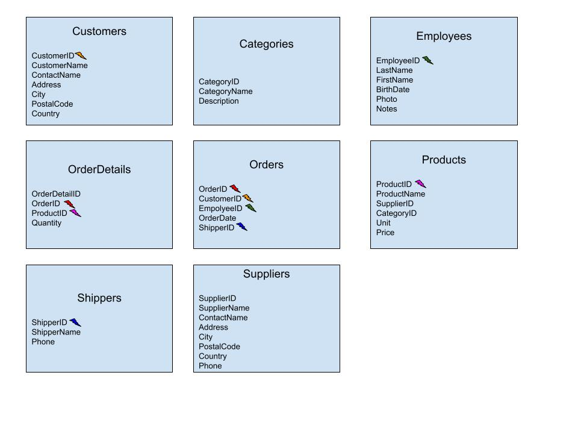

# Shopify_Tech_Challenge

## Question 1:
### (2019_Winter_Data_Science_Intern_Challenge_Data_Set.csv)
Given some sample data, write a program to answer the following: <br>
On Shopify, we have exactly 100 sneaker shops, and each of these shops sells only one model of shoe. We want to do some analysis of the average order value (AOV). When we look at orders data over a 30 day window, we naively calculate an AOV of $3145.13. Given that we know these shops are selling sneakers, a relatively affordable item, something seems wrong with our analysis. <br>


a. Think about what could be going wrong with our calculation. Think about a better way to evaluate this data. <br>
b. What metric would you report for this dataset? <br>
c. What is its value? <br>

## Ans Q1

  After viewing the data through basic ordering, it is clear that there are some visible outliers. The order_amount rows range from 90 to 1760 then jump ranging from 25725 to 704000. The large jump in values most definitely impact the data therefore an average would not give the best analysis. Using median would be a better option (Google BigQuery was used for the codes below in relation to Question 1). 
  
```
-- checks the distinct order values to see what is creating the average
SELECT
  DISTINCT(order_amount) AS order_amount
FROM
  `shopify-challenge-350015.tech_challenge.2019_Winter_Data_Science_Intern_Challenge`
ORDER BY order_amount DESC


-- Checks average order cost without outlires
SELECT
  ROUND(AVG(order_amount),2) AS avg_order_amount
FROM
  `shopify-challenge-350015.tech_challenge.2019_Winter_Data_Science_Intern_Challenge`
WHERE
  order_amount<= 1760 -- will remove all the higher outliers
-- AVG without outlires = 302, now to check median


-- Grabbs the median
SELECT
  DISTINCT(PERCENTILE_CONT(order_amount, 0.5)OVER()) AS median_order_amount -- bigquery does not have a median function so percentile can be used to grab the middle number
FROM
  `shopify-challenge-350015.tech_challenge.2019_Winter_Data_Science_Intern_Challenge`
 -- median 284, significant different compared to avg of 3145
```

After running the code, the median (284) would be the better choice for data evaluation. As the avg (3145) in question is heavily biased by the outliers that only represent 1.26% of the total data, therefore misrepresenting the remaining 98% (The query to check outlier percentage is in the code block below).

```
-- Checks the percentage of outliers     
SELECT
  SUM(top.top_order_amount/ bot.total_order_amount)*100 AS percent_of_top_pay
FROM ( -- First Sub query counts all the values that are over 1760
  SELECT
    COUNT(order_amount) AS top_order_amount
  FROM
    `shopify-challenge-350015.tech_challenge.2019_Winter_Data_Science_Intern_Challenge`
  WHERE
    order_amount >1760 ) AS top,
  ( -- second sub query counts all rows
  SELECT
    COUNT(order_amount) AS total_order_amount
  FROM
    `shopify-challenge-350015.tech_challenge.2019_Winter_Data_Science_Intern_Challenge` ) AS bot
```

## Question 2:
### https://www.w3schools.com/SQL/TRYSQL.ASP?FILENAME=TRYSQL_SELECT_ALL
Please use queries to answer the following questions. Paste your queries along with your final numerical answers below. <br>

 <br>
The Scheema above was used to navigate the joins in order for the questions. <br>

a. How many orders were shipped by Speedy Express in total? <br>
Ans. There are a total of 54 orders that were shipped by Speedy Express
```
-- join table where all orders are held and find the sum based on ShipperID
SELECT 
  COUNT(s.ShipperID)
FROM 
  Shippers AS s
JOIN 
  Orders AS o
ON s.ShipperID = o.ShipperID
WHERE s.ShipperID = 1 -- Speedy Express shipperID = 1
```

b. What is the last name of the employee with the most orders? <br>
Ans. The Last name of the employee with the most orders is Peacock. With a total of 50 orders.
```
-- Combine employee table and orders table to count for orders and group by employee
SELECT 
  e.LastName, 
  COUNT(o.OrderID) AS order_count
FROM 
  Employees AS e
JOIN 
  Orders AS o
ON E.EmployeeID = o.EmployeeID
GROUP BY e.LastName
ORDER BY order_count DESC
```

c. What product was ordered the most by customers in Germany? <br>
Ans. The most ordered product, in relation to quantity, is Boston Crab Meat

```
-- Combine multiple tables to grab product name and its total quantity ordered and filtering by 'Germany'
SELECT 
  p.ProductName, 
  SUM(od.Quantity) AS total_quantity
FROM 
  Customers AS c
JOIN 
  Orders AS o
ON c.CustomerID = o.CustomerID
JOIN 
  OrderDetails AS od
ON od.OrderID = o.OrderID
JOIN 
  Products as p
ON p.ProductID = od.ProductID
WHERE Country = 'Germany'
GROUP BY p.ProductName
Order BY total_quantity DESC
```


